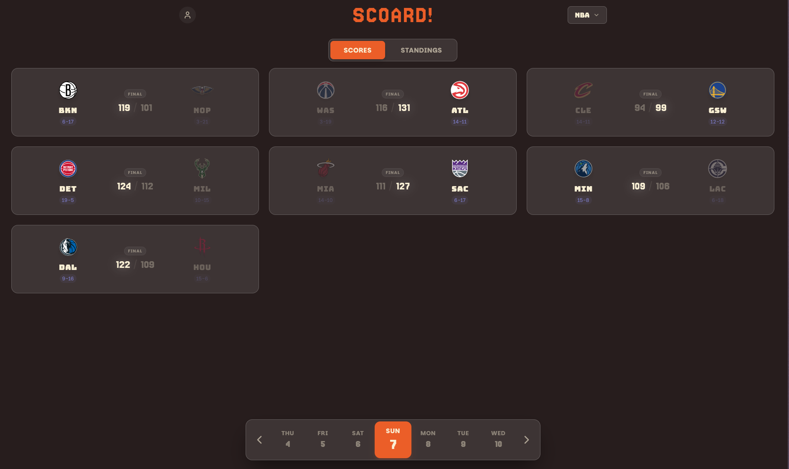

# SCOARD: See the game blind

A modern, multi-sport score app with data visualization to simulate the feeling of watching the game without watching it

**Live Demo:** [scoard.vercel.app](https://scoard.vercel.app)



## Features

-   **Live Scoreboard:** Real-time updates for all NBA games with live possession indicators.
-   **Enhanced Virtual Court:** 
    -   **Sequential Playback:** Intelligent event queue system that visualizes plays one-by-one for a broadcast-like feel.
    -   **Dynamic Overlays:** Visual alerts for Timeouts, Substitutions, and Quarter updates.
    -   **Smart Notifications:** Context-aware side popups for points, rebounds, assists, steals, and blocks.
    -   **Accurate Mapping:** Precise shot locations with specific logic for offensive/defensive rebounds and free throws.
-   **Game Schedule:** Browse past results and upcoming fixtures with an intuitive date picker.
-   **Detailed Stats:** Access box scores, play-by-play feeds, and team performance metrics with active player indicators.
-   **Modern UI:** A "Fun Pastel" dark theme featuring glassmorphism, smooth Framer Motion animations, and fully responsive design.

## Tech Stack

### Frontend
-   **Framework:** [React](https://react.dev/) (via [Vite](https://vitejs.dev/))
-   **Styling:** [Tailwind CSS](https://tailwindcss.com/)
-   **Animations:** [Framer Motion](https://www.framer.com/motion/)
-   **Icons:** [Lucide React](https://lucide.dev/)
-   **HTTP Client:** Axios

### Backend
-   **Runtime:** [Node.js](https://nodejs.org/)
-   **Framework:** [Express](https://expressjs.com/)
-   **Language:** TypeScript
-   **Data Source:** NBA Official CDN APIs

## Getting Started

### Prerequisites
-   Node.js (v18+ recommended)
-   npm or yarn

### Installation

1.  **Clone the repository**
    ```bash
    git clone https://github.com/KushalM23/Scoard.git
    cd Scoard
    ```

2.  **Install Dependencies**
    This project uses npm workspaces. You can install dependencies for both frontend and backend from the root:
    ```bash
    npm install
    ```

### Running the Application

You can start both the frontend and backend servers simultaneously using the provided Python script (Windows/Linux):

```bash
python start_servers.py
```

Or run them individually in separate terminals:

**Backend:**
```bash
npm run dev:backend
# Runs on http://localhost:3000
```

**Frontend:**
```bash
npm run dev:frontend
# Runs on http://localhost:5173
```

## Project Structure

```
Scoard/
├── backend/                # Express server & API proxy
│   ├── src/
│   │   └── server.ts       # Main server entry point
│   └── package.json
├── frontend/               # React application
│   ├── src/
│   │   ├── components/     # Reusable UI components (Header, GameCard, etc.)
│   │   ├── pages/          # Route pages (Home, Game)
│   │   └── App.tsx
│   └── package.json
├── start_servers.py        # Script to launch dev environment
└── package.json            # Root configuration & workspaces
```
## Future updates 
-   Add Power Rankings to NBA
-   Add Player Overview
-   Add Team Overview
-   Add F1 sport
-   Add IPL/cricket

## Contributing

Contributions are welcome! Please feel free to submit a Pull Request.
