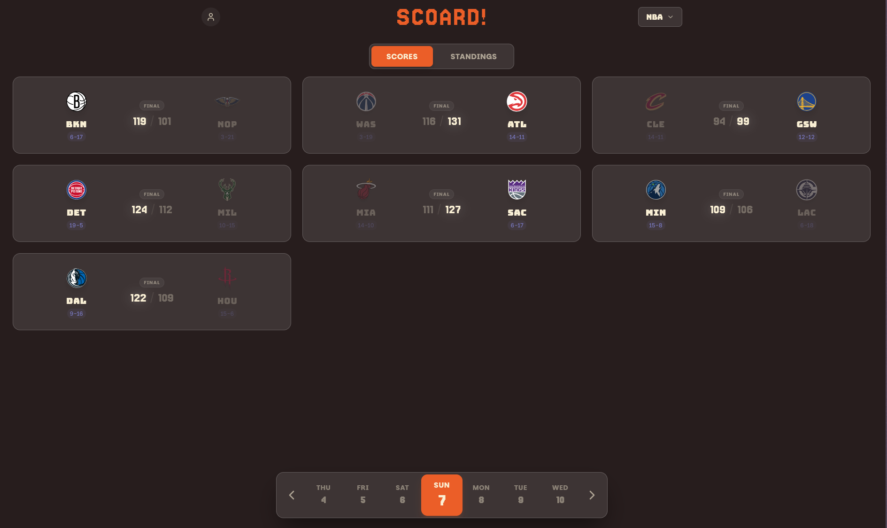

# SCOARD: See the game blind

A modern, multi-sport score app with data visualization to simulate the feeling of watching the game without watching it

**Live:** [scoard.vercel.app](https://scoard.vercel.app)



## Features

-   **Live Scoreboard:** Real-time updates for all NBA games with live scores, game clock, and quarter information.
-   **Enhanced Virtual Court Visualization:** 
    -   **Sequential Playback:** Intelligent event queue system that visualizes plays one-by-one for a broadcast-like experience.
    -   **Dynamic Overlays:** Visual alerts for timeouts, substitutions, and quarter transitions.
    -   **Smart Notifications:** Context-aware side popups displaying points, rebounds, assists, steals, and blocks.
    -   **Accurate Shot Mapping:** Precise shot location visualization with specific logic for offensive/defensive rebounds and free throws.
-   **Game Schedule:** Browse past results and upcoming fixtures with an intuitive date picker interface.
-   **Comprehensive Stats:** Access detailed box scores, play-by-play feeds, and team performance metrics with active player indicators.
-   **League Standings:** Full NBA standings with conference/division rankings, win-loss records, and current streaks.
-   **Modern UI:** Featuring a "Fun Pastel" dark theme with glassmorphism effects, smooth Framer Motion animations, and fully responsive design.

## Tech Stack

-   **Framework:** Next.js 15
-   **UI Library:** React 19
-   **Styling:** Tailwind CSS
-   **Animations:** Framer Motion
-   **Icons:** Lucide React
-   **HTTP Client:** Axios
-   **Date Handling:** date-fns
-   **Language:** TypeScript 5
-   **Data Sources:** NBA Official CDN & Stats APIs

## Getting Started

### Prerequisites
-   Node.js (v18+ recommended, tested on v22.19.0)
-   [pnpm](https://pnpm.io/) (v10+ recommended)
    ```bash
    npm install -g pnpm
    ```

### Installation

1.  **Clone the repository**
    ```bash
    git clone https://github.com/KushalM23/Scoard.git
    cd Scoard
    ```

2.  **Install Dependencies**
    ```bash
    pnpm install
    ```

### Running the Application

**Development:**
```bash
pnpm dev
# Runs on http://localhost:3000
```

**Production:**
```bash
pnpm build
pnpm start
```

**Package Manager:**
- This project uses [pnpm](https://pnpm.io/) for package management
- Tested with Node.js v22.19.0 and pnpm v10+
- A `pnpm-lock.yaml` file is included for reproducible installs

## API Routes

The app includes serverless API routes:

- `GET /api/games/date/[date]` - Fetch all games for a specific date (format: YYYY-MM-DD)
- `GET /api/games/[gameId]` - Get detailed game data including scores, players, and stats
- `GET /api/games/[gameId]/pbp` - Get play-by-play data for live game visualization
- `GET /api/standings` - Fetch current NBA league standings

All routes use NBA's official CDN and Stats APIs with no authentication required.

## Project Structure

```
Scoard/
├── app/                          # Next.js App Router
│   ├── api/                      # API routes (serverless functions)
│   │   ├── games/
│   │   │   ├── [gameId]/        # Individual game data
│   │   │   │   ├── route.ts     # Game details endpoint
│   │   │   │   └── pbp/         # Play-by-play data
│   │   │   │       └── route.ts
│   │   │   └── date/[date]/     # Games by date
│   │   │       └── route.ts
│   │   └── standings/           # NBA standings API
│   │       └── route.ts
│   ├── components/              # React components
│   │   ├── GameCard.tsx         # Game list item with score display
│   │   ├── Header.tsx           # Navigation header
│   │   ├── Hero.tsx             # Hero section with date picker
│   │   ├── Layout.tsx           # Page layout wrapper
│   │   ├── PreviousMatchups.tsx # Team head-to-head history
│   │   ├── Scoreboard.tsx       # Live game scoreboard with clock
│   │   ├── Standings.tsx        # League standings table
│   │   ├── StatsSection.tsx     # Box score statistics
│   │   ├── TopPerformers.tsx    # Top players display
│   │   ├── VirtualCourt.tsx     # Animated court visualization
│   │   └── WinProbability.tsx   # Win probability chart
│   ├── game/[gameId]/           # Dynamic game detail pages
│   │   └── page.tsx
│   ├── lib/                     # Shared utilities
│   │   └── statsApi.ts          # NBA Stats API client with retry logic
│   ├── types/                   # TypeScript type definitions
│   │   └── index.ts             # Game, team, player types
│   ├── layout.tsx               # Root layout with metadata
│   ├── page.tsx                 # Homepage with game listing
│   └── globals.css              # Global styles & custom theme variables
├── public/                      # Static assets (images, icons, fonts)
├── .gitignore                   # Git ignore rules
├── next.config.js               # Next.js configuration
├── next-env.d.ts                # Next.js TypeScript declarations
├── tailwind.config.ts           # Tailwind CSS config with custom theme
├── postcss.config.mjs           # PostCSS config for Tailwind
├── tsconfig.json                # TypeScript compiler config
├── package.json                 # Dependencies & scripts
├── pnpm-lock.yaml               # pnpm lock file
├── IMMEDIATE_OPTIMIZATION_STEPS.md  # Performance optimization guide
├── SSE_IMPLEMENTATION_PLAN.md   # Server-Sent Events implementation plan
├── NBA_API_GUIDE.md             # NBA API documentation
└── readme.md                    # This file
```

## Contributing

Contributions are welcome! Here's how you can help:

1. Fork the repository
2. Create a feature branch (`git checkout -b feature/amazing-feature`)
3. Commit your changes (`git commit -m 'Add amazing feature'`)
4. Push to the branch (`git push origin feature/amazing-feature`)
5. Open a Pull Request

Please ensure your code:
- Follows the existing TypeScript/React patterns
- Includes proper types for new components/functions
- Works on both desktop and mobile viewports
- Maintains the existing theme and design system
